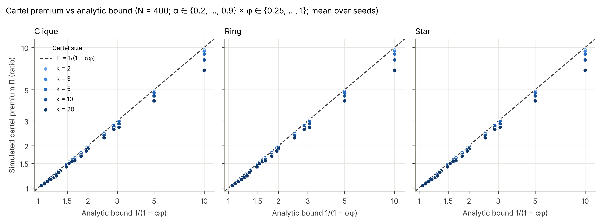
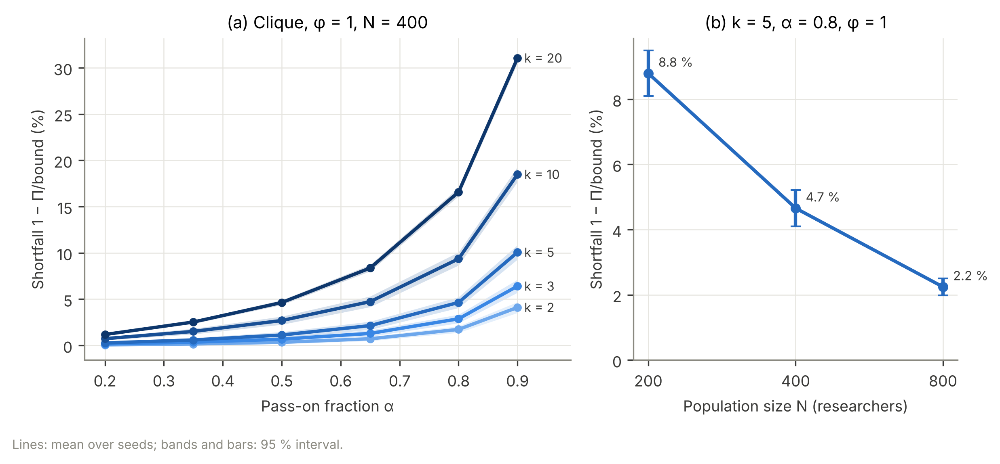

# Milestone 1 — flows, core metrics, configuration, RNG; E0 verification

**Status:** complete; **reviewed and accepted** (all three decisions in §4 agreed; amendments
applied to `CLAUDE.md` §2.3.7, §3 and §10, and the burn-in rule implemented in
`Params.check_horizon`). 178 tests pass; `ruff check` and `ruff format --check` clean.
E0 ran at N = 400, 10 seeds, d = 40 recipients per donor (≈ 30 s on this machine).

§4 records three decisions. All were accepted at review and are now in `CLAUDE.md`.

---

## 1. What was built

| Module | Contents |
|---|---|
| `config.py` | `Params`: one frozen dataclass with **every** §5 parameter. Each field records its unit, explored range and rationale ("assumption" where there is no source). Validation, YAML loading, a stable config hash (excludes the seed) and `check_horizon()`, which issues a `HorizonWarning` when T − T_eval < 5/(−ln α) (§3). |
| `rng.py` | `RNGStreams`: generators keyed by stream **name** via `SeedSequence(spawn_key=…)`, not by spawn order. Adding a stream or drawing more from one never changes another (CRN). |
| `flows.py` | `flow_step` (§4.7 sketch, verbatim logic), `iterate_fixed_W`, closed-form `steady_state` (including the steady pool when rows sum to less than 1), `return_multipliers` Γ = (I − αWᵀ)⁻¹ via a solve, `cycle_return_shares` r_i (truncated series, §4.6 S4). |
| `metrics.py` | Gini, top-10 % share, Lorenz, expected output, oracle allocation (A1), efficiency E, Spearman, reciprocity index, within-group mutual flow, group in/outflow, cartel premium Π, the analytic bound, and "who pays" by quality decile. |
| `safeguards.py` | **S2 cap projection only** (water-filling). See the scope note below. |
| `strategies.py` | **Cartel rows only** (clique, ring, star; sincere remainder over non-members, so the internal share is exactly φ), a random sparse W standing in for sincere rows, and random membership. |
| `experiments.py`, `plotting.py` | E0 runner, the CLI (`run` / `plot`), and parquet output with metadata. |

**Scope note.** §11 lists only `flows`, `metrics`, config and RNG for M1. E0 and the §10 analytic tests
also need cartel rows (§2.3.5–6) and the cap (§2.3.7), so I added those two pure functions early. No
other part of `strategies.py` or `safeguards.py` exists yet.

## 2. Analytic vs simulated (E0; worst case over 10 seeds)

| § | Check | Analytic | Simulated | Worst abs. error | Tol. | Pass |
|---|---|---|---|---|---|---|
| 2.3.1 | Annual iteration → closed form, α ∈ {0.2 … 0.9} | 0 | — | 1.1e-13 | 1e-10 | ✓ |
| 2.3.1 | Same, with half of all donations routed via the pool | 0 | — | 2.8e-14 | 1e-10 | ✓ |
| 2.3.2 | Σ K* = N·B (α = 0.5, 0.9) | 400 | 400 | 1.1e-13 | 4e-8 | ✓ |
| 2.3.2 | Σ K* = N·B with pool | 400 | 400 | 5.7e-13 | 4e-8 | ✓ |
| 2.3.3 | α = 0 → K = B | 1 | 1 | 0 | 1e-10 | ✓ |
| 2.3.3 | Uniform W → K = B | 1 | 1 | 4.9e-15 | 1e-10 | ✓ |
| 2.3.4 | Group balance identity (random subsets, size 1–200) | 0 | — | 5.7e-14 | 4e-8 | ✓ |
| 2.3.5 | Exact cartel form (all 360 grid cells per seed) | 0 | — | 2.0e-13 | 1e-10 | ✓ |
| 2.3.5 | Π ≤ 1/(1 − αφ) across the E2 grid | — | max(Π − bound) = −3.5e-5 | 0 | 1e-9 | ✓ |
| 2.3.6 | Ring φ = 1: within-cartel mutual flow | 0 | 0 (exactly) | 0 | 0 | ✓ |
| 2.3.6 | Ring vs clique Π (α = 0.5, k = 5) | 1.978 | 1.978 | 1.1e-15 | 5 % | ✓ |
| 2.3.7 | Cap bound, excess placed outside the cartel | — | — | 0 | 1e-9 | ✓ |
| 2.3.7 | Cap bound, excess **leaks to the pool**, strict form | — | — | **1.06e-2** | 1e-9 | ✗ (see §4.1) |
| 2.3.7 | Same, amended bound | — | — | 0 | 1e-9 | ✓ |
| 2.3.8 | Oracle: max gain from 500 budget-preserving perturbations | 0 | 0 | 0 | 1e-12 | ✓ |
| §6 | E(A0) = 0, E(A1) = 1 | 0 / 1 | 0 / 1 | 0 | 1e-12 | ✓ |

### Cartel premium (clique, φ = 1, N = 400; mean [min, max] over 10 seeds)

| α | bound | k = 2 | k = 5 | k = 10 | spec (§2.3.5) |
|---|---|---|---|---|---|
| 0.5 | 2 | 1.993 [1.979, 1.996] | 1.978 [1.958, 1.990] | 1.946 [1.917, 1.960] | 1.996 / 1.975 / 1.946 |
| 0.8 | 5 | 4.914 (worst shortfall 3.2 %) | 4.768 (6.2 %) | 4.532 (11.5 %) | worst 2 / 7 / 10 % |
| 0.9 | 10 | 9.590 (6.2 %) | 8.993 (11.8 %) | 8.152 (20.6 %) | worst 4 / 11 / 19 % |

The spec values are reproduced to within seed variation. The shortfall at k = 5 and α = 0.8 shrinks
with N: **8.8 % → 4.7 % → 2.2 %** for N = 200 → 400 → 800 (reference about 9 / 4 / 2 %). The mechanism is
as described in §2.3.5: the cartel's lost outflow lowers outsiders' receipts, and with them the cartel's
own inflow I_C. That inflow falls by 2 %, 5 %, 9 % and 17 % for k = 2, 5, 10 and 20 at α = 0.8.

## 3. Things that surprised me or are worth knowing

1. **For φ = 1 the aggregate premium is identical across topologies, to machine precision (2e-15),**
   not merely "≈". The members' outflow is zero whatever the internal wiring, so outsiders' receipts,
   and hence I_C, do not depend on the topology. For φ < 1, ring and clique differ by < 0.015 % and star
   by < 0.5 %. The topology changes *who inside* the cartel gets the money, not how much the cartel gets.
2. **Detection signatures differ sharply.** Within-cartel reciprocity index at φ = 1: clique 0.98,
   ring **0**. Mean cycle-return share r̄ (L = 3, α = 0.5, k = 5): clique 0.17, star 0.20, ring
   **0**. A 5-ring returns money only after 5 hops, so the default L = 3 for S4 cannot see it either.
   This matters for E4: S4 with L = 3 only catches rings with k ≤ 3. Rings with k ≥ L + 1 evade S3
   *and* S4.
3. **Burn-in prefactor.** The geometric rate α is confirmed, but reaching max |R − R*| < 1e-6 from
   R(0) = B·1 took 71 years at α = 0.8 (spec: "≈ 60"; ln(1e-6)/ln α = 62) and 158 years at α = 0.9.
   The extra ~10 years come from the prefactor: the initial deviation |R* − B| exceeds 1. This
   does not affect the e⁻⁵ rule in the no-pool case (residual transient at the minimum burn-in:
   0.5 % at α = 0.8, 0.6 % at α = 0.9, both < e⁻⁵ = 0.67 %).
4. **Per-seed variation.** "Π within 1 % of 2.0" (k = 2, α = 0.5) holds for the seed mean (1.993) and
   for every one of the 10 E0 seeds (worst 1.979, a 1.0 % shortfall). Over other random graphs I saw
   single seeds down to about 2.2 %. The test therefore asserts the 10-seed mean, as discussed below.

## 4. Decisions (accepted at review)

### 4.1 Proposed amendment to §2.3.7 and §10 `test_cap_bounds_premium`

The bound Π ≤ 1/(1 − α·min(1, (k−1)c)) **holds strictly whenever the capped excess is placed with
non-members**, as it is for φ < 1 (verified with no violations in 90 E0 cases and 80 test cases). It
**can be exceeded when the excess goes to the pool**, i.e. a φ = 1 clique with (k−1)c < 1, by up to
1.06 % at c = 0.05 and α = 0.8. The cause is a return channel that §2.3.7 omits. Money diverted to the
pool comes back to every agent as pool/N, so the cartel recaptures a share k/N of its own leakage.

Adding that channel gives an effective internal share φ′ = φ_max + (1 − φ_max)·k/N. With φ′ the bound
held in every case I tried (70 E0 cases and 30 further seeds; closest margin −0.04 %). **This is a
numerical finding, not a proof.** Pool redistribution also changes I_C at second order, so I would not
claim the amended bound is exact.

*Proposed wording for §2.3.7:* "…so Π ≤ 1/(1 − α·φ_max) when the capped excess is redistributed
outside the cartel. If it goes to the pool, members recapture k/N of it, and
φ′ = φ_max + (1 − φ_max)k/N replaces φ_max (verified numerically)."

The tests currently implement exactly this split (strict bound when there is no leak; amended bound
plus "strict within 1 %" when there is a leak).

### 4.2 Proposed amendment to §3 (burn-in rule) when the pool is used

In the §2.2/§4.7 timing, `pool(t−1)` is money withheld from donations made in year t − 1, which are
themselves based on R(t − 2). Pooled money therefore takes **one year longer** to arrive than direct
flows. The pool channel decays at up to **√α per year rather than α**, so it needs up to twice the
burn-in. Measured residual transient at the minimum burn-in T − T_eval = ⌈5/(−ln α)⌉:

| α | no pool | 50 % via pool | 90 % via pool | e⁻⁵ |
|---|---|---|---|---|
| 0.5 | 0.27 % | 1.7 % | 3.1 % | 0.67 % |
| 0.8 | 0.53 % | 2.9 % | 5.8 % | 0.67 % |
| 0.9 | 0.61 % | 3.2 % | 6.5 % | 0.67 % |

This does not affect M1 or M2 (no pool). It will affect M3 safeguard runs with tight horizons. With the
defaults (T = 60, T_eval = 10, i.e. 50 years of burn-in) and α ≤ 0.8 it is negligible. Two options:

- **(a)** keep the timing and tighten the rule to T − T_eval ≥ 10/(−ln α) whenever any pool-diverting
  safeguard is on (≈ 45 years at α = 0.8, ≈ 95 at α = 0.9, which exceeds the default T at α = 0.9); or
- **(b)** redistribute the pool in the year it arises (no extra lag), which restores rate α.

**Decision: (a).** `Params.diverts_to_pool()` detects any pool-diverting safeguard (cap < 1, δ > 0,
δ_L > 0, p_audit > 0, K_max set), and `check_horizon()` then requires 10/(−ln α).

### 4.3 Seed-mean tolerance for `test_cartel_premium_analytic`

The test asserts that the **mean over 10 seeds** is within 1 % of 2.0, and that every seed is ≤ 2.0.
It does not check each seed individually, because single random graphs can fall about 2 % short.
**Decision:** confirmed; §10 now states the seed-mean form.

## 5. Not yet done (by design)

Population, network, perception, the sincere strategy, A0–A2 runs, `docs/ODD.md` and `model.py` all
belong to M2. The "< 2 s per single-seed default run" target can only be measured once `model.py`
exists. No "switch-off" tests yet, because no Phase-2+ mechanism exists to switch off.
