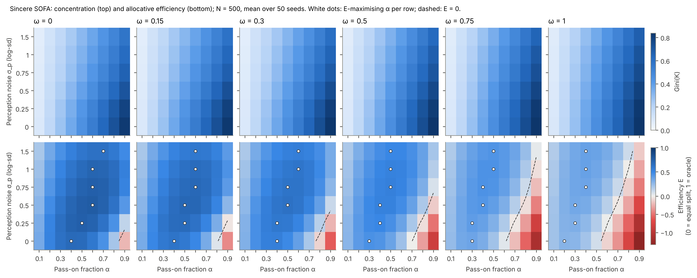
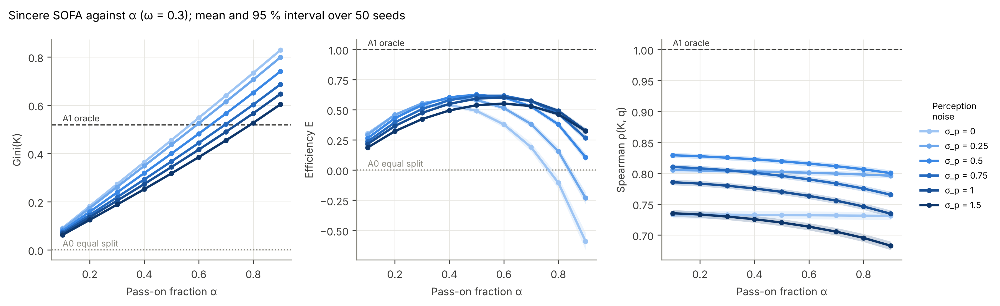
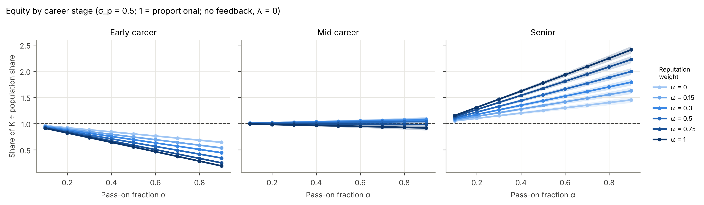

# Milestone 2 — population, network, perception, sincere donors, A0–A2; E1

**Status:** complete, awaiting review. 229 tests pass; `ruff check` and `ruff format --check` are clean.
E1 ran at development scale (N = 300, 10 seeds; 5 s) and, on the cloud container, at full scale
(N = 500, 50 seeds; 39 s). Both give the same qualitative picture. Numbers below are full scale
unless marked otherwise.

**Two decisions are needed** (§5): one on the network's small-field drain, and whether to keep running E1 by closed form.

---

## 1. What was built

| Module | Contents |
|---|---|
| `population.py` | Quality (log-normal, mean 1); fields by largest-remainder quota; labs of about 6 nested in fields; career stages by quota, with a senior guaranteed in every lab; supervisors (a senior in the same lab); visibility v(0). Each attribute has its own named sub-stream. |
| `network.py` | Awareness network (§4.2). The scale is found by bisection so that the expected out-degree including own lab equals d. Own lab is always known; at least 5 contacts outside the lab, topped up within the field. |
| `perception.py` | q̂_ij (§4.3). Tastes are drawn as standard normals and scaled by σ_p only when used, so runs that differ only in σ_p share the same draws. |
| `strategies.py` | Sincere rule (§4.4): eligibility, homophily scores, top-m, w ∝ S^β. Vectorised. |
| `baselines.py` | A0 equal split, A1 oracle, A2 sincere SOFA with every safeguard off. |
| `metrics.py` | Share ratios by group; `allocation_metrics()`, the single source for every per-allocation metric. |
| `model.py` | `SOFAModel`: `World` (population, network, tastes), the §3 step order, annual and equilibrium flow modes, W cached when static, `run()` → `Results` (yearly tidy table plus agent snapshots for the evaluation years), and `equilibrium()` for the closed form. Mechanisms from later milestones raise `NotImplementedError` rather than being silently ignored. |
| `docs/ODD.md` | ODD protocol v1. |
| E1 | `experiments/configs/E1.yaml`, runner, three figures. |

**Performance.** A single-seed default run (N = 500, T = 60, annual mode) takes 0.5 s, against a 2 s
target; this is enforced by a test. Mean out-degree is 39.9 against a target of 40.

**Tests added** (50): population structure and quotas, supervisors, the visibility–quality link,
network degree, lab, top-up and homophily ratio, perception limits and unbiasedness, the sincere-row
properties (top-m, w ∝ S^β, eligibility, empty rows), CRN (the world is bit-identical across α, σ_p,
ω, β and m; other streams never shift population or network draws), reproducibility, annual →
equilibrium convergence, budgets of A0–A2, exact annual-mode conservation
(Σ K(t) = N·B(1 − α^{t+1})), the timing target, and refusal of unbuilt mechanisms.

**Switch-off test.** Passing a fixed W (`W_override`) reproduces the Milestone 1 iteration
*bit-for-bit* (`test_switch_off_to_static_W_reproduces_m1`).

## 2. Why E1 uses the closed form

With all-sincere donors, static visibility (λ = 0) and no yearly perception noise, W never changes.
Following §2.3 ("never simulate where the closed form suffices"), E1 solves the steady state directly.
The annual iteration converges to the same K (rtol 1e-9 at T = 120; tested).

## 3. Key results (E1, N = 500, 50 seeds)

**Default cell** (α = 0.5, σ_p = 0.5, ω = 0.3), mean [95 % interval]:

| Metric | A2 sincere SOFA | A1 oracle | A0 equal |
|---|---|---|---|
| Gini(K) | 0.400 [0.397, 0.402] | 0.519 | 0 |
| Top-10 % share | 0.380 [0.376, 0.385] | — | 0.10 |
| Efficiency E | **0.626** [0.616, 0.636] | 1 | 0 |
| Spearman ρ(K, q) | 0.819 [0.815, 0.823] | 1 | — |
| Early-career share ÷ population share | **0.693** [0.685, 0.702] | 1.01 | 1 |
| Senior share ÷ population share | 1.436 [1.403, 1.469] | — | 1 |
| Smallest field (8 %) share ÷ size | **0.852** [0.822, 0.882] | — | 1 |
| Reciprocity index | 0.111 | — | — |

Development scale gives E = 0.648 and Gini = 0.386, which agree with full scale within seed noise.

### 3.1 H1, checked against the data (not tuned)

| H1 claim | Result |
|---|---|
| Concentration rises with α | **Supported.** Gini rises strictly with α in all 36 (σ_p, ω) combinations. |
| Efficiency peaks at intermediate α | **Supported.** The E-maximising α lies between 0.2 and 0.7. The best cell is E = 0.76 (α = 0.6, σ_p = 0.5, ω = 0). |
| Efficiency falls with ω | **Supported.** E falls monotonically with ω in every (σ_p, α) cell. |
| Efficiency falls with σ_p | **Not supported in general.** E falls monotonically with σ_p in only 15 % of (ω, α) cells. |

**The σ_p result is the main surprise.** Perception noise has two opposing effects:
- **Noise blurs the ranking.** This lowers efficiency and dominates at low α. At α = 0.3 and ω = 0.3, E falls from 0.55 to 0.42 as σ_p goes 0.25 → 1.5.
- **Noise spreads the money.** Donors disagree, so more researchers receive something. This counteracts
  over-concentration and dominates at high α. At α = 0.9 and ω = 0.3, E rises from **−0.59** (σ_p = 0) to
  +0.33 (σ_p = 1).

With noiseless perception, every donor ranks the same researchers at the top. Only **27 %** of
researchers then receive any donation (68 % at σ_p = 0.5, 95 % at σ_p = 1.5), and with θ = 0.5 the
diminishing returns make that concentration wasteful. As a result, the efficiency-maximising α *rises*
with σ_p: it is about 0.4 with exact perception and about 0.6–0.7 with σ_p ≥ 1. The same mechanism explains
why ρ(K, q) is *lower* at σ_p = 0 than at σ_p = 0.25–0.5: most researchers tie at K = B.

**Negative efficiency is real.** At high α combined with low σ_p or high ω, SOFA does worse than an equal split
(the dashed E = 0 contour in the surfaces figure). The region grows with ω: at ω = 1 it starts near
α = 0.55.

### 3.2 Equity without any feedback (λ = 0), a baseline for H5

Even before the reputation feedback loop exists, sincere SOFA underfunds early-career researchers:
0.69× their population share at the default, falling linearly with α. The oracle does not (1.01×),
because quality is independent of career stage. There are two channels:
1. **Perception (ω):** visibility carries the 0.5× early-career stage multiplier. At α = 0.5 the ratio falls
   from 0.80 (ω = 0) to 0.55 (ω = 1).
2. **Awareness (τ):** even at ω = 0 the ratio is 0.80, because fewer people know early-career researchers.
   Mean in-degree is 24 for early-career researchers, 43 for mid and 61 for seniors.

**Small fields lose money structurally.** The 8 % field receives 0.85× its size-proportional share at
α = 0.5, and 0.65× at α = 0.9. The mechanism is the group-balance identity (§2.3.4). With a fixed
10 : 1 within/between ratio and a fixed degree, members of small fields have few in-field colleagues, so
they send **47 %** of their donations out of the field (the 35 % field sends 15 %). The result is a net
outflow of 0.12 per member per year.

## 4. Things worth knowing

- **Results do not depend on the choice of scale.** Development and full scale agree; the only systematic
  difference is reciprocity (0.15 at N = 300 vs 0.11 at N = 500), as expected for a sparser graph.
- **Exact conservation in annual mode** from R(0) = B·1: Σ K(t) = N·B(1 − α^{t+1}). This is now a test.
  Year 1 already holds (1 − α²) of the budget.
- **What E measures.** E uses θ = 0.5 and no mechanism costs. c_sofa and panel overheads enter at M4,
  when production is switched on.

## 5. Decisions needed

### 5.1 The small-field drain: modelling choice or artefact?
The 10 : 1 ratio is applied to *probabilities*. The in-field share of a researcher's contacts
therefore grows with field size, from 53 % in the smallest field to 85 % in the largest. Consequently small fields are net
donors to large ones even with perfectly sincere donors. That may be realistic (small fields do
depend on outsiders' attention), but it will confound RQ5 ("what happens to small fields") with a
network assumption. Options:
- **(a)** keep it, and report it as a structural effect (no change);
- **(b)** calibrate p_in per field so that every field has the same in-field share of contacts
  (for example 80 %), which removes the size effect from the network;
- **(c)** keep (a) as the default and add (b) as a switch for a sensitivity run in E5.

My recommendation is **(c)**. It changes no default and makes the effect testable.

### 5.2 Closed form for static-W experiments
E1 uses the closed form (§2 above). I propose the same rule for every later experiment in which W cannot
change between years, with annual mode used only when strategies respond to last year's state. Please
confirm.

## 6. Not yet done (by design)

Cartels in the full model, herders, reciprocators, deference, transparency regimes, S1/S3/S4, E2–E4
(M3); production, feedback, turnover, A3/A4 (M4). The cartel rows from M1 are not yet wired into
`SOFAModel`.
