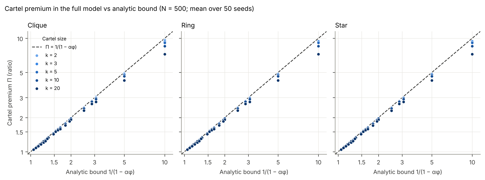
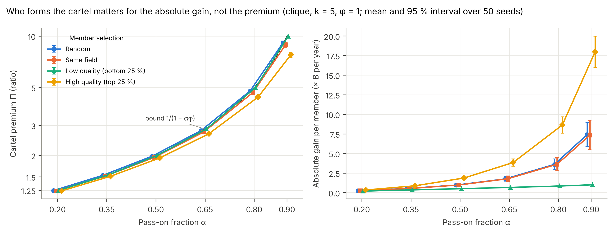
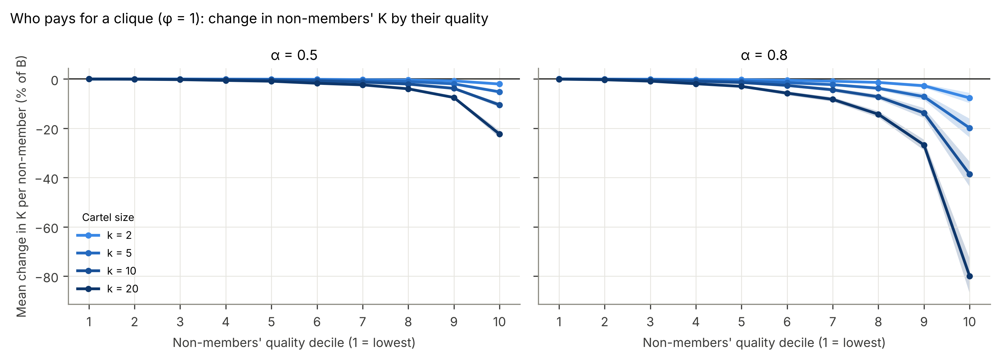
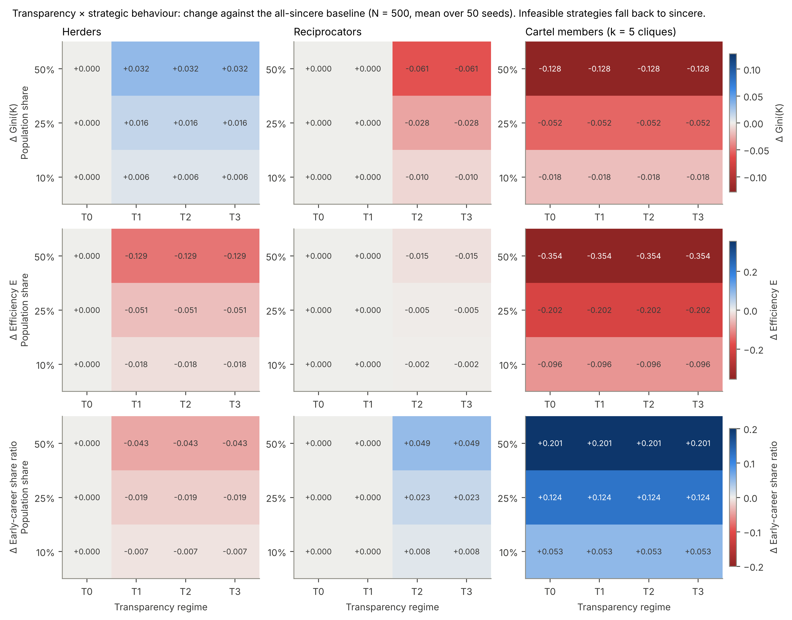
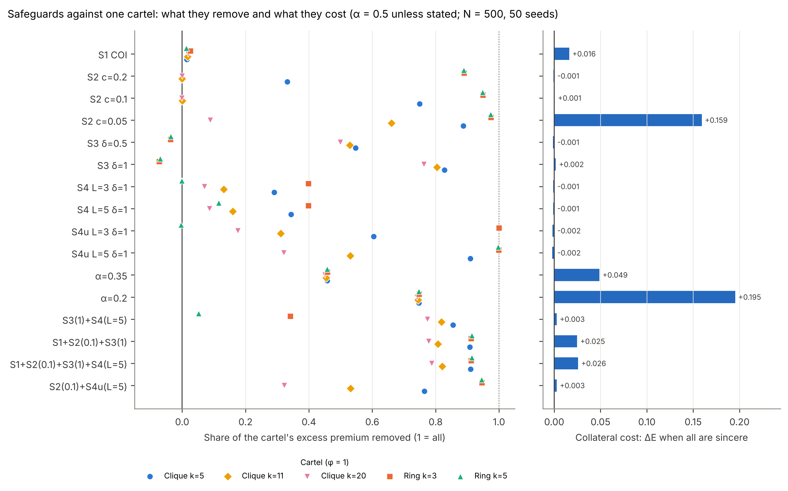
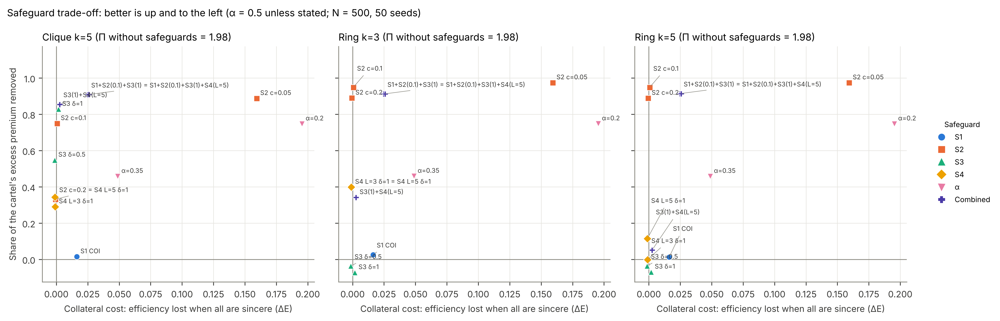

# Milestone 3 — cartels, herders, reciprocators, deference, transparency, safeguards S1–S4

**Status:** complete, awaiting review. 275 tests pass; `ruff check` and `ruff format --check` clean.
E2–E4 (and E1 again) ran at development scale (N = 300, 10 seeds) and at full scale (N = 500, 50
seeds; E2 2.0 min, E3 1.8 min, E4 3.3 min). The two scales agree qualitatively; numbers below are full
scale. Switching every M3 mechanism off reproduces the M2 model **bit-for-bit** (output fingerprint
identical to commit `7f20272`).

**Section 6 lists four decisions for you and section 7 the judgement calls I made.** The headline:
**the per-recipient cap is the only cheap safeguard that works against rings. The pairwise discount
(S3) backfires against them, and the cycle discount (S4) as specified is too weak to matter.**

---

## 1. What was built

| Module | Additions |
|---|---|
| `config.py` | `regime`, `x_herd`, `x_recip`, `cartels` (switch), validation. |
| `information.py` (new) | Regimes T0–T3, feasibility table, `effective_strategies` with fallback counts. |
| `population.py` | Strategy codes; `Roles` (strategy, cartel id, cartels in routing order); `assign_roles` from the `strategy` stream: cartels by `cartel_selection`, then nested herder/reciprocator sets, then deference. |
| `strategies.py` | Deference scores; herder scores; reciprocity shares and reciprocator rows; cartel member rows in the full model. |
| `safeguards.py` | S1 COI; S3 mutual-flow discount; S4 cycle-return discount (clipped, cached per W); `FlowSafeguards`. |
| `flows.py` | `steady_state_general`: the exact fixed point with flow-level safeguards (S3 is nonlinear). |
| `model.py` | Roles, regimes, fallbacks; all strategies; S1–S4 in the §3 order; `is_static()` covers reactive strategies; `equilibrium_state()` and `solve()` raise on dynamic W; `evaluate()` solves or simulates; score cache while perception is static. New yearly metrics: fallbacks, cartel share of K, and cycle-return share overall and within cartels (evaluation years). |
| `experiments.py` | E2, E3, E4 runners; annual cross-check for every solved experiment (E1–E4). |
| `plotting.py` | E2 (premium vs bound, member selection, who pays), E3 heatmaps, E4 dot plot, frontier and table. |
| `docs/ODD.md` | v2. |

**Solve-with-guard rule** (agreed at M2 review), as implemented. E2 and E4 are static and fully
solved. In E3, 33 of 48 cells per seed are solved and the 15 reactive cells (herders under T1+,
reciprocators under T2+) are simulated. Annual cross-checks: largest relative difference **3.6e-12**
(E2), 8.7e-14 (E3), 4.9e-14 (E4), 6.1e-14 (E1).

**Tests added** (43): roles and selection rules, disjoint cartels, nested shares, the deference
scope, CRN when toggling cartels, the feasibility table and fallback counts per regime, infeasible
strategies reproducing sincere exactly, regime-invariance for sincere donors, herder (h = 0) and
reciprocator (ρ = 0) limits, reactive strategies forcing simulation, the §2.3.5 exact identity and
exact internal share in the full model, zero ring mutual flow, S1 (no within-lab flow), S3 and S4
unit behaviour (including the clip and ring visibility only for L ≥ k), the fixed point against the
annual limit, the S3/S4 ring result, property-based conservation under random W, α, cap, δ, δ_L and L,
switch-off, and end-to-end runner smoke tests.

## 2. E2 — cartels (RQ2, H2)

**Premium** (clique, φ = 1, random members; mean over 50 seeds):

| α | bound | k = 2 | k = 5 | k = 10 | k = 20 |
|---|---|---|---|---|---|
| 0.5 | 2 | 1.994 | 1.978 | 1.965 | 1.918 |
| 0.8 | 5 | 4.922 | 4.780 | 4.632 | 4.258 |
| 0.9 | 10 | 9.673 | 9.133 | 8.530 | 7.249 |

These closely match the static-W results of E0. The §2.3.5 exact identity holds in every cell
(tested to 1e-10). For φ = 1 the premium is topology-invariant to machine precision (2.7e-15), as in M1.

**H2 (premium independent of members' quality): supported in relative terms, with a twist.**

| Members (clique, k = 5, φ = 1) | Π at α = 0.5 | Π at α = 0.9 | Absolute gain per member at α = 0.9 |
|---|---|---|---|
| low quality (bottom 25 %) | 1.999 | **9.97** (at the bound) | 1.0 B / year |
| random | 1.978 | 9.13 | 8.1 B / year |
| high quality (top 25 %) | 1.934 | 7.76 | **19.5 B / year** |

Low-quality cartels capture the full relative premium. High-quality cartels capture slightly less,
because they already received large inflows, part of which depends on their own outflow returning. In
absolute money, however, high-quality cartels gain about 20× more than low-quality ones (2.4× more
than random ones).

**Who pays: the best researchers.** The cost lands overwhelmingly on the highest-quality non-members,
whom the members' sincere donations used to reach. At α = 0.8 (k = 5), the top decile bears 55 % of the
outsiders' loss and the top two deciles bear 75 %.

**The §2.3.5 upper bound is not strict in the full model (see decision 6.1).** 193 of 62,400 cells
(0.3 %) exceed 1/(1 − αφ), by at most **0.8 %**. All have φ < 1, and most are at α ≥ 0.8. The bound
requires the inflow from outsiders, I_C, not to rise. In the heterogeneous network it can rise:
- the cartel equalises receipts between rich and poor members;
- a poor member's outside giving then *increases*, even though the cartel's total outflow falls;
- if that member's recipients feed money back to the cartel, I_C rises.

Worst case: one member's outflow went from 12.74 to 8.28 with no return path, while the other's went
from 0.90 to 4.18 with a 3.4 % one-hop return, and I_C rose by about 0.5 %. This is the same class of
omission as the M1 pool-recapture term. The exact identity still holds; only the bound's assumption
fails.

## 3. E3 — transparency (RQ3, H4)

Changes against the all-sincere baseline at a population share of 50 % (95 % intervals over seeds):

| Behaviour (feasible regime) | ΔE | ΔGini | Δ early-career ratio |
|---|---|---|---|
| Herders (T1+) | **−0.129** [−0.138, −0.121] | +0.032 | −0.043 |
| Reciprocators (T2+) | −0.015 [−0.017, −0.012] | **−0.061** | +0.049 |
| Cartel members (any regime) | **−0.354** [−0.363, −0.346] | −0.128 | **+0.201** |

- **Herding** concentrates money and lowers efficiency, as expected. Herders converge to a stable
  allocation (rank stability 1.0), with no oscillation.
- **Reciprocity** is nearly harmless for efficiency and *flattens* the distribution. Returning money to
  one's donors spreads it.
- **Widespread cartels flatten the distribution and destroy efficiency.** Gini falls because members are drawn at random
  and pool money among themselves. The early-career ratio rises for the same reason: random members
  include many early-career researchers, and cartels by-pass the visibility channel.
- **Fallbacks** are exactly x·N wherever a strategy is infeasible (for example 250 at T0 with 50 %
  herders), and zero otherwise.

**H4 cannot be tested yet (decision 6.4).** In M3 the regime acts only as a feasibility gate. T1, T2
and T3 are therefore identical for herders, and T2 = T3 for reciprocators. Cartels are unaffected
because monitoring and shirking arrive at M5. The heatmap shows this as identical columns.

## 4. E4 — safeguards (RQ4, H3)

Premium without safeguards ≈ 1.98 for all three cartels (α = 0.5, φ = 1, k = 5 clique, 3-ring,
5-ring). "Removed" = share of the excess premium (Π − 1) eliminated. "Collateral" = efficiency lost
when everyone is sincere. Full table: `figures/E4_table.csv`.

| Safeguard | Clique 5 | Ring 3 | Ring 5 | Collateral ΔE | Sincere money via pool |
|---|---|---|---|---|---|
| S1 COI | 0.02 | 0.03 | 0.01 | 0.016 | 0 % |
| S2 cap c = 0.2 | 0.33 | 0.89 | 0.89 | 0.000 | 0 % |
| **S2 cap c = 0.1** | **0.75** | **0.95** | **0.95** | **0.001** | 0 % |
| S2 cap c = 0.05 | 0.89 | 0.97 | 0.97 | 0.159 | 50 % |
| S3 δ = 0.5 | 0.55 | **−0.04** | **−0.04** | 0.000 | 5 % |
| S3 δ = 1 | 0.83 | **−0.07** | **−0.07** | 0.002 | 10 % |
| S4 L = 3 | 0.29 | 0.40 | **0.00** | 0.000 | 1.4 % |
| S4 L = 5 | 0.34 | 0.40 | 0.11 | 0.000 | 1.6 % |
| α = 0.35 | 0.46 | 0.46 | 0.46 | 0.049 | — |
| α = 0.2 | 0.75 | 0.75 | 0.75 | 0.195 | — |
| S3 + S4 (L = 5) | 0.86 | 0.34 | 0.05 | 0.003 | 11 % |
| S1 + S2(0.1) + S3 | 0.91 | 0.91 | 0.91 | 0.025 | 9 % |
| S1 + S2(0.1) + S3 + S4 | 0.91 | 0.91 | 0.91 | 0.026 | 10 % |

**H3: supported, and stronger than stated.**
1. **S3 does not just miss rings: it rewards them.** The ring premium *rises* (−4 % to −7 % "removed").
   S3 taxes the ordinary two-way flows of sincere donors. Ring members give nothing to outsiders, so
   their inflow is never mutual and escapes the tax, while their counterfactual selves would have paid
   it. (Tested: the ring's absolute K rises under S3.)
2. **S4 as specified is weak.** Each returning hop is weighted by α, so a k-ring has r = α^{k−1}
   (0.0625 for k = 5 at α = 0.5). With L < k it sees nothing: S4 at L = 3 removes 0.00 of the 5-ring
   premium. Even with L = 5 and δ_L = 1, it removes only 11 %. "Correction by S4" holds only for rings
   no longer than L, and even then only partially (40 % for the 3-ring).
3. **The cap is the only cheap safeguard that works against rings.** At c = 0.1 it removes 95 % of the ring premium at
   essentially zero collateral cost. A ring sends 100 % to one recipient, and a sincere donor with m = 10
   rarely sends anyone more than 10 %. **But the cap is evadable by size:** φ_max = min(1, (k − 1)c), so
   a clique with k ≥ 1/c + 1 is untouched. Checked: under c = 0.1, an 11-member clique keeps
   Π = 1.959, the same as without the cap.
4. **Costs.** A cap below 1/m (c = 0.05) pushes half of all sincere money through the pool (E −0.16).
   Lowering α works against every topology but is expensive (α = 0.2: −0.20). S1 removes nothing
   against randomly formed cartels yet costs 0.016, because it removes labmates from sincere choice
   sets. It would matter only for within-lab cartels, which E4 did not include.

## 5. Things worth knowing

- **Development and full scale agree** in sign and approximate size. One example: the S2 c = 0.1 ring removal is
  0.946 at N = 300 and 0.948 at N = 500. Collateral costs of S3 shrink with N (0.018 at N = 300, 0.002
  at N = 500), because the network is sparser relative to its size.
- **S4 clipping.** r_i can exceed 1 (a pair at α = 0.9, L = 5 gives r = 1.63), so 1 − δ_L r_i is clipped at 0.
- **Performance.** The S4 return shares are cached per W, because the fixed-point solver would otherwise
  repeat L − 1 dense matrix products on every iteration.

## 6. Decisions needed

### 6.1 §2.3.5 bound in heterogeneous networks
Proposed wording: "Π ≤ 1/(1 − αφ) holds when the inflow from outsiders does not rise. With φ < 1 in a
heterogeneous network, internal equalisation can redirect members' outside giving towards
recipients who feed the cartel, raising I_C. The full model exceeds the bound in 0.3 % of E2 cells, by
≤ 0.8 %." §10's static-W test is unaffected and still passes. **Accept?**

### 6.2 S4 design
As specified, S4 cannot catch rings longer than L, and for rings within L it sees only α^{k−1}.
Options:
- **(a)** keep it as specified and report it as a negative result;
- **(b)** add a variant with *unweighted* return (r_i = Σ_{l≤L} (W^l)_ii, the probability that a unit
  returns), which sees a k-ring fully when L ≥ k;
- **(c)** leave cycles to S5 audits (M5).

My recommendation is **(a) + (b)** as a switch, so E4 can show what a cycle-aware rule *could* do. (b) still needs L ≥ k.

### 6.3 Cap evasion by larger cliques
The E4 grid uses k = 5 only, which flatters the cap. I propose adding k ∈ {5, 11, 20} cliques under
the cap to E4 (cheap: about 2 extra minutes). **Add?**

### 6.4 H4 and the regime in M3
Until M5, the regime only switches strategies on or off. Either accept that H4 waits for M5 (my
recommendation, since the spec puts shirking and monitoring there), or make herding strength depend on
the regime now. The latter is not in the spec, so I have not done it.

## 7. Judgement calls I made (please check)

1. **`cartels` switch, default off.** §5 lists "1 cartel" as the default. I read that as the number used
   when cartels are on, so that the default run stays Bollen's A2 and §0's switch-off rule holds.
2. **Deference** applies to every otherwise-sincere early-career researcher when γ_up ≠ 1, rather than to
   a sampled share.
3. **Cartel members know each other:** internal routing ignores the awareness network.
4. **Selection rules:** `low_q` and `high_q` draw at random within the bottom or top quality quartile;
   `same_field` uses the field of a randomly drawn agent.
5. **Members' sincere remainder** is re-optimised as top-m over eligible non-members, not the old row
   renormalised (the M1 static shortcut).
6. **Order and timing:** S1 before S2; S3 before S4. S4's r uses W(t) after row-level safeguards.
   Reciprocity uses F(t − 1) *after* flow-level safeguards, i.e. what was actually received.
7. **Shares:** herders and reciprocators are drawn among non-cartel agents, nested as shares grow.
   E3's "cartel members" are k = 5 cliques with φ = 1.
8. **E4** uses one randomly formed cartel with φ = 1 and adds L = 5 to show S4 when L ≥ k. The S1
   "co-author" extension is not implemented.

## 8. Not yet done (by design)

Production, visibility feedback, turnover, A3 panel review, A4 lottery and E5 (M4); imitation,
shirking, audits S5, best-responders and E6 (M5); the S6 receipt ceiling (optional).

---

## Addendum — M3 review decisions applied

Decisions at review: 6.1 accepted (§2.3.5 amended); 6.2 (a) + (b): the spec rule is kept, and the
unweighted variant was added as the switch `s4_weighted = False`, labelled "S4u" (§4.6 amended);
6.3 cliques of k = 11 and 20 added to E4 (§7 amended); 6.4 H4 waits for M5.

E4 rerun (N = 500, 50 seeds; annual cross-check 4.9e-14). Share of the excess premium removed:

| Safeguard | Clique 5 | Clique 11 | Clique 20 | Ring 3 | Ring 5 | Collateral ΔE |
|---|---|---|---|---|---|---|
| S2 cap c = 0.1 | 0.75 | **0.00** | **0.00** | 0.95 | 0.95 | 0.001 |
| S2 cap c = 0.05 | 0.89 | 0.66 | 0.09 | 0.97 | 0.97 | 0.159 |
| S3 δ = 1 | 0.83 | **0.80** | **0.76** | −0.07 | −0.07 | 0.002 |
| S4 (spec) L = 5 | 0.34 | 0.16 | 0.09 | 0.40 | 0.12 | 0.000 |
| **S4u L = 5** | 0.91 | 0.53 | 0.32 | **1.00** | **1.00** | 0.000 |
| S4u L = 3 | 0.60 | 0.31 | 0.18 | 1.00 | 0.00 | 0.000 |
| S2(0.1) + S4u(L = 5) | 0.76 | 0.53 | 0.32 | 0.95 | 0.95 | 0.003 |
| S1 + S2(0.1) + S3 | 0.91 | 0.81 | 0.78 | 0.91 | 0.91 | 0.025 |
| α = 0.2 | 0.75 | 0.75 | 0.74 | 0.75 | 0.75 | 0.195 |

- **The cap is fully evaded by size.** At c = 0.1, cliques of 11 and 20 lose nothing, as predicted by
  φ_max = min(1, (k − 1)c).
- **The unweighted S4 catches rings completely** (removal ≈ 1.00) at no measurable collateral cost,
  provided L ≥ k. It also removes 0.91 of the 5-clique's premium, but only 0.53 and 0.32 for cliques of
  11 and 20: in a large clique each internal edge carries little weight, so the return probability per
  member within L hops is lower, and the discount is correspondingly weaker.
- **No single rule covers both shapes.** S3 is the only cheap rule that holds up against large
  cliques, but it backfires on rings; S4u is the reverse. The pairing **S3 + S4u** is the obvious
  candidate. It was not in the agreed grid, so it is not run here; adding it to E4 is a one-line
  change if wanted.

