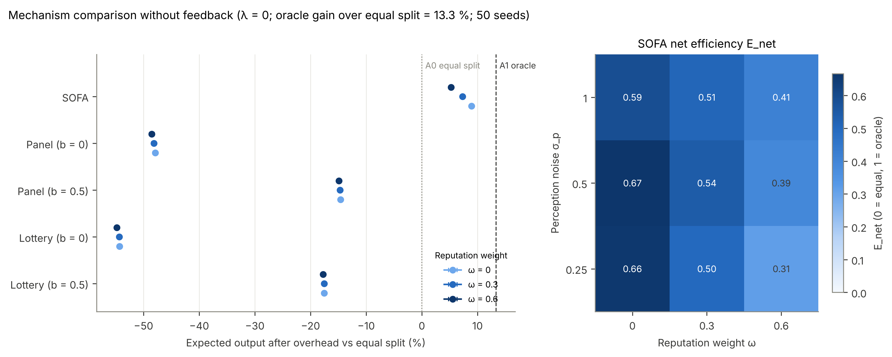
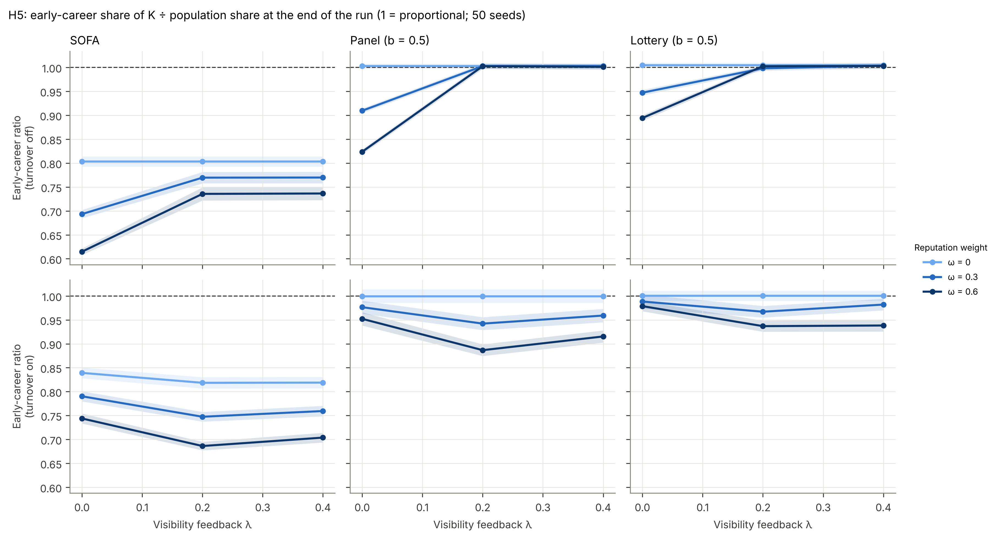
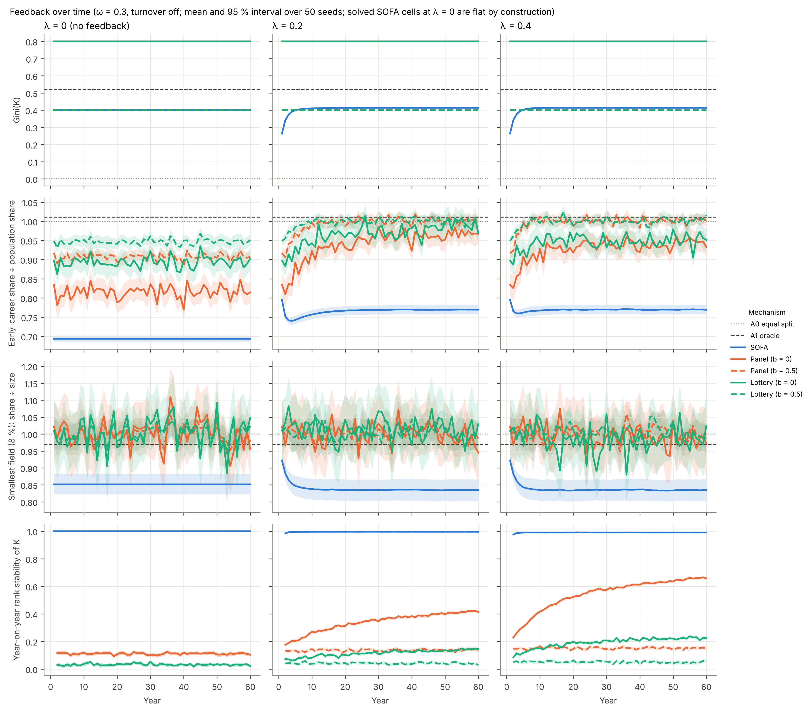

# Milestone 4 — production, reputation feedback, turnover; panel review and lottery; E5

**Status:** complete, awaiting review. 297 tests pass; `ruff check` and `ruff format --check` clean.
E5 ran at development scale (N = 300, 10 seeds; 1 min) and at full scale (N = 500, 50 seeds;
11 min). Numbers below are full scale; the development run agrees qualitatively. With every M4
mechanism off, the model reproduces the M3 output **bit-for-bit** (fingerprint over annual runs,
equilibria, herders, reciprocators, cartels and S3/S4, identical to commit `d09ad5f`).

This milestone also applied the M3 review decisions (§2.3.5 wording, unweighted S4 switch, larger
cliques in E4); see the addendum in `reports/M3.md`.

**Three decisions are needed** (§5). The most consequential is **how panel grants are funded**: under
the spec's default, 80 % of researchers get nothing, and that alone decides the comparison.

---

## 1. What was built

| Module | Contents |
|---|---|
| `production.py` (new) | Expected and realised output (§4.8), visibility update, career ages and promotion, the newcomer awareness rule, contact resampling (r_A). |
| `baselines.py` | A3 panel review and A4 lottery (exact budget N·B, optional equal base b_share), and per-mechanism overhead (SOFA: c_sofa; panel and lottery: c_write + n_rev·c_rev). |
| `model.py` | Dynamic agent state (q, stage, v, A, ε change only when a mechanism needs it); `mechanism` ∈ {sofa, equal, oracle, panel, lottery} in the **same yearly loop**, so every mechanism faces identical production, feedback and turnover (§7 E5); step 6 production and visibility; step 7 turnover and resampling; `is_static()` extended. |
| `metrics.py` | Overhead, net efficiency, and **output relative to equal split** (see §3). |
| `experiments.py`, `plotting.py` | E5 runner (cells, yearly trajectories, comparison) and four figures. |
| `docs/ODD.md` | v3. |

**Tests added** (22 new, 2 retired): output formula and noise, visibility update (mean preserved),
feedback dynamics, λ = 0 leaving the allocation untouched, overhead and net efficiency, stage
promotion, turnover (stages persist, supervisors valid, own-lab awareness, world untouched,
reproducible), contact resampling (degree and lab preserved), panel and lottery budgets and
selection, the lottery triaging on the panel's own scores (CRN), comparators in the model,
solved-versus-simulated routing, the output-vs-equal scale, and an E5 smoke test.

## 2. Judgement calls (please check)

1. **Comparators run inside the model loop** (`Params.mechanism`), rather than as one-off
   allocations, so "compare with A3/A4 under the same feedback" (E5) is literal.
2. **ω is the evaluators' reputation weight** for donors and panels alike: E5 sets ω_p = ω.
3. **Overhead:** panel and lottery applicants each write one proposal (c_write) and n_rev reviews
   (equal review load). The lottery's triage is assumed to need the same reviews. SOFA costs c_sofa
   for everyone; equal split and oracle cost nothing.
4. **Turnover:** a newcomer takes over the departing senior's slot (lab, field) and the lab's contact
   list. Others' awareness of the slot is thinned by (v_new/v_old)^τ, consistent with P ∝ v^τ and
   avoiding a network recalibration. Quality and visibility are drawn as at initialisation (early
   multiplier). Initial career ages are uniform within stage bands. **Turnover with cartels is
   refused**, because the spec does not say what happens to a departing member's cartel.
5. **Contact resampling:** a share r_A of non-lab contacts is replaced each year, drawn by current
   visibility with the field ratio; the degree is preserved.
6. **Metrics are recorded before turnover** (step 7), so K and quality refer to the same people.
7. **Solved cells in E5** (SOFA at λ = 0 without turnover; equal split and oracle without turnover)
   appear as flat trajectories. Annual cross-check: 6.1e-14.

## 3. Reading the efficiency numbers

E = (Y − Y_A0)/(Y_A1 − Y_A0) divides by the oracle's gain over equal split, which is only **13.3 %** of
output at the defaults. Small output differences therefore become large E values: a panel losing 15 %
of output has E ≈ −1.1. I report **output relative to equal split** (after overhead) as the primary
comparison, with E alongside.

## 4. Results

### 4.1 Mechanism comparison (RQ6, H6), λ = 0

| Mechanism (ω = 0.3) | Output vs equal split | E (allocative) | E_net | Overhead | Gini |
|---|---|---|---|---|---|
| A1 oracle | +13.3 % | 1 | 1 | 0 % | 0.52 |
| **SOFA** (σ_p = 0.5) | **+7.3 %** | 0.63 | 0.54 | 1 % | 0.40 |
| A0 equal split | 0 | 0 | 0 | 0 % | 0 |
| Panel, b = 0.5 | −14.7 % | −0.15 | −1.12 | 13 % | 0.40 |
| Lottery, b = 0.5 | −17.6 % | −0.40 | −1.34 | 13 % | 0.40 |
| Panel, b = 0 (spec) | −48.1 % | −3.07 | −3.66 | 13 % | 0.80 |
| Lottery, b = 0 (spec) | −54.4 % | −3.61 | −4.13 | 13 % | 0.80 |

**H6: supported.** SOFA's overhead (1 %) is a small fraction of the panel's (13 %). Its advantage depends
strongly on ω (+8.9 % at ω = 0 to +5.3 % at ω = 0.6) and weakly, non-monotonically, on σ_p, as in E1.

**Why panels do so badly here — three model features, all from the spec:**
1. **b_share = 0 means 80 % of researchers get K = 0 and produce nothing.** This one assumption
   accounts for about two-thirds of the panel's deficit (−48 % vs −15 %). See decision 5.1.
2. **Panel noise exceeds the signal:** σ_panel = 1.0 on the log-quality scale, while σ_q = 0.5. Even
   allocative E is negative for b = 0.5 panels: they concentrate money almost at random, and
   concave production (θ = 0.5) penalises that.
3. **Overhead:** 13 % of output, versus 1 % for SOFA.

**θ dominates the comparison.** At θ = 0.8 (weak diminishing returns), the spec panel is almost
neutral (−0.9 %) and SOFA reaches +30 % (oracle +64 %). At θ = 0.3, SOFA gains only +2 % and panels
lose 56 %. θ is the main structural uncertainty for RQ6 and belongs in E7.

### 4.2 Feedback and equity (RQ5, H5)

Early-career share ÷ population share, at the end of the run (ω = 0.3):

| Mechanism | λ = 0 | λ = 0.2 | λ = 0.4 | λ = 0, turnover | λ = 0.4, turnover |
|---|---|---|---|---|---|
| **SOFA** | **0.69** | 0.77 | 0.77 | 0.79 | 0.76 |
| Panel, b = 0.5 | 0.91 | 1.00 | 1.00 | 0.98 | 0.96 |
| Lottery, b = 0.5 | 0.95 | 1.00 | 1.00 | 0.99 | 0.98 |
| Oracle | 1.01 | 1.01 | 1.01 | 1.01 | 1.01 |

**H5: half supported.**
- **Supported:** under SOFA the early-career share stays below the population share in every
  condition (0.69–0.79).
- **Not supported:** reputation feedback does **not** drive this. Without turnover, feedback *raises*
  the early-career share (+0.076, 95 % CI [0.072, 0.080]) and *lowers* the senior share (1.44 → 1.30).
  Output-based visibility gradually replaces the initial stage-based visibility, which carried the
  0.5× early-career multiplier. Only with turnover does feedback lower the early-career share,
  modestly (−0.031 [−0.036, −0.026]): a steady stream of low-visibility newcomers keeps arriving.

**Where SOFA's early-career deficit comes from: who knows whom.** The awareness network is drawn once,
from *initial* visibility (P ∝ v^τ). Early-career researchers have mean in-degree 24 against 61 for
seniors, and that persists unless contacts are resampled. A targeted check (6 seeds, ω = 0.3):

| λ | r_A (contact resampling) | Early-career ratio | Output vs equal |
|---|---|---|---|
| 0 | 0 | 0.70 | +6.8 % |
| 0.2 | 0 | 0.78 | +7.7 % |
| 0 | 0.1 | 0.72 | +7.2 % |
| **0.2** | **0.1** | **1.00** | +7.5 % |

With feedback **and** contact resampling, the early-career deficit disappears entirely, at no cost
in output. SOFA's equity problem in this model is a **network-memory** problem, not a funding-rule
problem. This was a probe, not part of the agreed grid; see decision 5.2.

**Small fields:** SOFA keeps the smallest field at 0.84–0.90× its size, the structural drain found
at M2. Panels and lotteries hold it at ≈ 1.0, because they ignore networks.

**Concentration and stability over time:**

- **Gini:** SOFA's Gini reaches its steady level within about 10 years and barely moves with feedback
  (0.40 → 0.41).
- **SOFA rank stability** stays ≈ 0.99, so funding is very persistent.
- **Panels show the Matthew effect most clearly.** Year-on-year stability of the spec panel rises from
  0.11 (λ = 0) to **0.66** (λ = 0.4): funded output raises visibility, which raises the next panel
  score. This hardly happens with b = 0.5 (0.15), because unfunded researchers keep producing.
- **Artefact to note:** with b = 0, turnover and λ = 0.4, panels give early-career researchers 1.39×
  their share. Unfunded incumbents produce nothing, so their visibility decays towards zero, and
  newcomers' default visibility then outranks them.

## 5. Decisions needed

### 5.1 Panel grants: is b_share = 0 intended?
Under the spec default, unfunded researchers receive no money at all, so 80 % produce nothing. That
decides RQ6 almost single-handedly. I recommend making **b_share = 1 − α** the headline comparator.
It matches SOFA's unconditional floor ((1 − α)·B = 0.5 B), so both systems give everyone the same
guaranteed share and differ only in how the rest is distributed. I would keep b_share = 0 as a
labelled variant. **Which should be the headline A3/A4?**

### 5.2 Contact resampling (r_A) in E5
The default r_A = 0 freezes initial (stage-biased) visibility into the network forever, and that
alone produces SOFA's early-career deficit. Should E5 include r_A ∈ {0, 0.1} as a factor? It costs
about 6 minutes extra.

### 5.3 Report output relative to equal split as the primary efficiency measure?
§6 defines E; I propose keeping it but leading with output vs equal split (§3) in figures and
summaries, because E magnifies differences when the oracle's gain is small.

## 6. Not yet done (by design)

Imitation, shirking, audits (S5), best-responders and E6 (M5); sensitivity analysis E7, final
figures and README (M6). The S6 receipt ceiling (optional) remains unimplemented.
