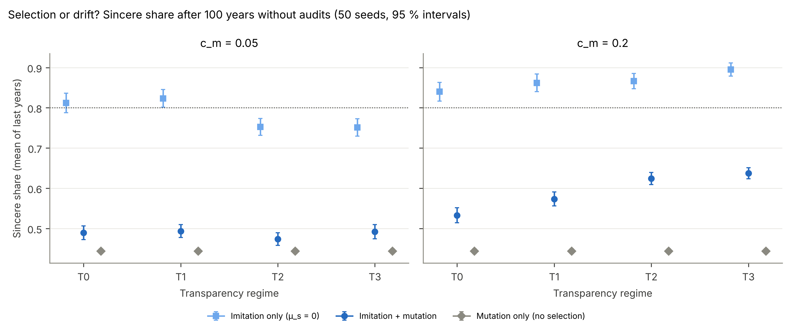
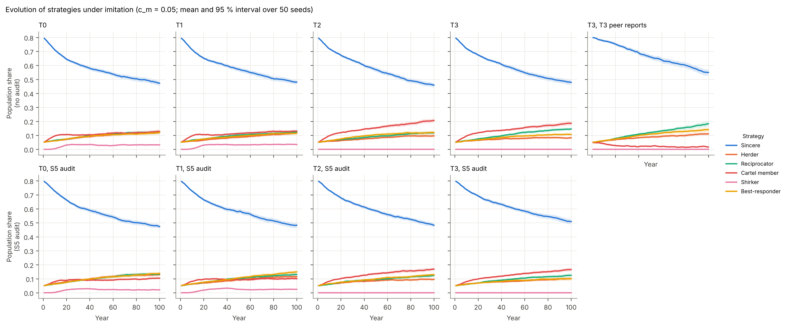
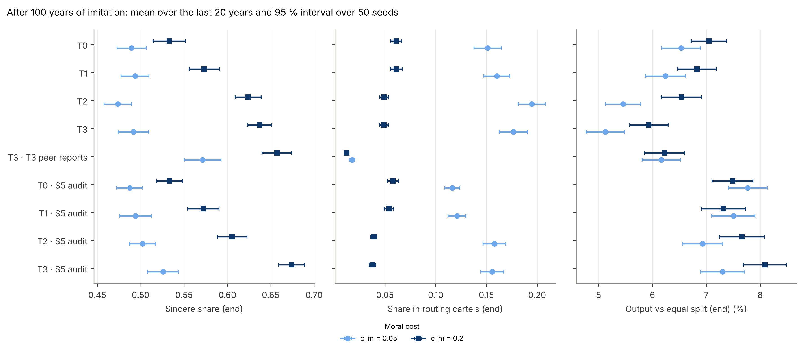

# Milestone 5 — imitation, shirking, audits (S5), peer reports, best-responders; E6

**Status:** complete, awaiting review. 314 tests pass; `ruff check` and `ruff format --check` are clean.
E6 ran at development scale (N = 300, 10 seeds; 1.4 min) and at full scale (N = 500, 50 seeds,
T = 100 years; 13 min); the two agree. With adaptation and audits off, the model reproduces the M4
output **bit-for-bit** (fingerprint identical to commit `b1b249f`, over eight scenarios including
herders, reciprocators, cartels with S3/S4, feedback with turnover and panels).

This milestone also applied the M4 review decisions (see the addendum in `reports/M4.md`).

**Headline.** Most of the raw drift away from sincere donating in E6 is **mutation, not selection**.
Measured against null models, two things decide whether sincere donating holds its ground. The first
is the moral cost of acting strategically. The second is how much the ledger reveals, because each
transparency level unlocks another strategy. Four decisions are needed (§6).

---

## 1. What was built

| Module | Contents |
|---|---|
| `adaptation.py` (new) | Fermi imitation, imitation pairs from contacts, payoffs, the shirking rule, best-response rows (fill to the cap), S5 audit sanctions, detection probability by regime, and a mutable `CartelRegistry` (join, leave, found, dissolve, survival log). |
| `flows.py` | `return_multiplier_rows`: rows of Γ by one solve, without an explicit inverse. |
| `population.py`, `information.py` | Strategy codes SHIRKER and BEST; best-responders need T3. Share `x_best`. |
| `model.py` | Step 7 (§3): S5 audits and peer reports (sanctions → pool), then shirking → detection → imitation → mutation. Cartels come from the registry when adaptation is on. Γ rows reuse one LU factorisation per W. Results carry a cartel survival log. |
| `config.py` | `adaptation` switch (default off), `evo_strategies`, `x_best`, `T_burn_strategies`. |
| `experiments.py` | E6 runner with null models. **All runners now use one BLAS thread per worker** (see §5). |
| `plotting.py` | E6 prevalence over time, end-state summary, and a selection-versus-drift figure. |
| `docs/ODD.md` | v4. |

**Tests added** (17 net): the Fermi rule, imitation pairs, registry operations, best-response rows
(cap and eligibility), Γ rows against the full matrix, the shirking rule's zero point, audit and
detection rules, registry–strategy consistency and reproducibility, imitation following payoffs (in
both directions), shirkers detected under T2 but not T0, audits sanctioning cliques with correct
conservation, peer reports dissolving cartels, best-responders requiring T3, switch-off, matched-floor
panel defaults, and an E6 smoke test.

**Conservation under sanctions.** Sanctions go to the pool and are recycled as a base top-up. At
steady state, kept K net of sanctions sums to N·B; gross K exceeds it by the sanctions (tested).

## 2. Judgement calls (please check)

1. **`adaptation` switch, default off.** The spec's defaults (r_imit = 0.1, μ_s = 0.01) would otherwise
   mutate strategic types into every default run, including A2.
2. **Shirking rule (myopic).** Each year a share r_imit of active members reconsider. A member shirks
   when c_m·B exceeds the own K it would lose by giving sincerely instead of to partners,
   (1 − α)·αR_i·Σ_j (w_ij^cartel − w_ij^sincere)·Γ_ij, using the return multipliers Γ the
   best-responder also uses. Shirkers stay shirkers until detected.
3. **Imitation copies the *visible* strategy.** Shirking is secret, so imitating any member means
   joining that cartel as an active member. If the cartel is full (k_max = 20), the imitator founds a
   new one. Payoffs of contacts are assumed observable in every regime.
4. **Founders.** A cartel of one has nobody to route to: it gives sincerely and pays no moral cost.
5. **The moral cost is paid only for strategies actually played.** An agent holding an infeasible
   strategy (for example a herder under T0) falls back to sincere play and pays nothing, so such
   strategies drift neutrally.
6. **S5 uses the same return-share definition as S4** (`s4_weighted`). The α-weighted default misses
   5-member cliques (r ≈ 0.17 < r_thr = 0.2), so E6 audits use the unweighted share.
7. **Peer reports** (T3, p_peer): the reported cartel's members are sanctioned like audited agents and
   the cartel is dissolved.
8. **Order within step 7:** audit and peer reports → shirking → detection → imitation → mutation. Sanctions
   come after production, so they cut K and payoff, not that year's output.
9. **Mutation** draws uniformly from {sincere, herder, reciprocator, cartel, best-responder}.
10. **Refused combinations:** turnover with adaptation (the cartel fate of departing members is
    unspecified), and adaptation or audits with non-SOFA mechanisms.
11. **E6 design:** start from 80 % sincere and 5 % each of herders, reciprocators, best-responders and
    cartel members (5-cliques); run T = 100 years and evaluate the last 20. **Null models** (added after
    the development run, see §3.1) cover every no-audit cell.

## 3. Results (E6, N = 500, 50 seeds)

### 3.1 Selection or drift?

Sincere share at the end (mean of the last 20 years, 95 % intervals), no audits:

| | T0 | T1 | T2 | T3 |
|---|---|---|---|---|
| **c_m = 0.05**, imitation only | 0.81 [0.79, 0.84] | 0.82 [0.80, 0.85] | **0.75** [0.73, 0.77] | **0.75** [0.73, 0.77] |
| c_m = 0.05, imitation + mutation | 0.49 | 0.49 | 0.47 | 0.49 |
| **c_m = 0.2**, imitation only | 0.84 [0.82, 0.86] | 0.86 [0.84, 0.88] | 0.87 [0.85, 0.89] | **0.90** [0.88, 0.91] |
| c_m = 0.2, imitation + mutation | 0.53 | 0.57 | 0.62 | 0.64 |
| Mutation only (no selection) | 0.44 | 0.44 | 0.44 | 0.44 |

- **Mutation drives most of the raw decline** from 80 % to about 50 %. Without selection, mutation alone
  takes the population to 44 % sincere. Raw prevalence figures would greatly overstate how attractive
  strategic behaviour is, so every claim below is made against the null models.
- **Is sincere donating evolutionarily stable?** At a moral cost of 0.2 × B, **yes**: imitation alone
  *raises* the sincere share above its starting 80 %, and the more the ledger reveals, the more
  (0.84 at T0 → 0.90 at T3). At 0.05 × B it holds under T0/T1 (≈ 0.82), but strategic play
  **invades under T2/T3** (0.75), where reciprocity and best responses become feasible.

### 3.2 Transparency enables strategic behaviour

Many agents nominally hold a strategy they cannot play: about 180–200 agents under T0 fall back to
sincere play. Counting what agents **actually do** (imitation + mutation, no audit):

| Strategic play actually observed | T0 | T1 | T2 | T3 |
|---|---|---|---|---|
| c_m = 0.05 | 12 % | 24 % | 41 % | **51 %** |
| c_m = 0.2 | 4 % | 13 % | 24 % | 36 % |

Each step up in transparency unlocks another strategy: herding at T1, reciprocity at T2, best responses
at T3.

### 3.3 H4: anonymity, shirking and cartel stability — supported

| | T0 | T1 | T2 | T3 | T3 + peer reports |
|---|---|---|---|---|---|
| Shirkers (share of population) | 3.2 % | 3.5 % | 0 | 0 | 0 |
| In routing cartels (c_m = 0.05) | 15 % | 16 % | **20 %** | 18 % | **1.8 %** |
| Cartels still alive at the end (c_m = 0.2) | 47 % | 50 % | **79 %** | 74 % | **7 %** |
| Median life of ended cartels (c_m = 0.2) | 20 y | 22 y | **38 y** | 36 y | 7 y |

- **Anonymity breeds shirking** (T0/T1 only, because p_low = 0.1), and cartels are smaller and
  shorter-lived there.
- **Transparency stabilises cartels:** under T2/T3, shirkers are expelled at once, and cartels live
  about twice as long and are more likely to survive the run.
- **Peer reports under T3 nearly eliminate cartels** (1.2–1.8 % membership, 93 % of cartels ended).
  This is the strongest anti-cartel measure in the model.
- **Herding needs T1 and appears there** (it is unlocked by the regime, §3.2).

### 3.4 Platform audits (S5) are weak

With p_audit = 0.5, an unweighted return share and s = 0.5, cartel membership falls only modestly
(c_m = 0.05: 15 % → 12 % at T0, 20 % → 16 % at T2). Expected sanctions are about 0.25 K a year,
small against a premium of about 2×. Output relative to equal split improves by
+0.4 to +2.2 percentage points with audits.

### 3.5 What strategic behaviour costs

Output relative to equal split stays between **+5.1 %** (T3, c_m = 0.05, no audit) and **+8.1 %**
(T3, c_m = 0.2, S5 audit), against +7.3 % for all-sincere SOFA. Even half the population playing
strategically costs at most about 2 percentage points of output, roughly a sixth of the oracle's
attainable gain (13 %). Early-career shares stay at 0.70–0.79, as in E5.

## 4. Things worth knowing

- **Development and full scale agree** (for example, sincere share under imitation and mutation at
  c_m = 0.2, T3: 0.67 at dev, 0.64 at full).
- **Best-responders** (T3, cap = 1) give everything to whoever returns most per unit. Under T3 they
  persist at 8–11 % of the population but do not take over. Whether they form reciprocal ties that
  audits catch was not measured.

## 5. Performance fix (affects every runner)

The parallel seeds each ran multi-threaded BLAS, oversubscribing the four cores: an N = 500 solve
took 0.7 s instead of about 10 ms. `map_seeds` now limits each worker to one BLAS thread, and the
model reuses one LU factorisation of (I − αW) per year. An E6 run went from about 60 s to 3 s.
Earlier results are unaffected in substance (thread count can change the last bits of floating-point
sums).

## 6. Decisions needed

1. **Mutation rate in E6.** At μ_s = 0.01 mutation dominates the raw prevalence. Keep it and report
   against the null models (current approach, my recommendation), or lower μ_s for E6 and E7?
2. **The shirking rule** (§2, call 2) is my construction. Accept it, or specify another? A natural
   alternative is imitation of payoffs within the cartel.
3. **S5 threshold.** With the α-weighted share the audit cannot see 5-cliques at r_thr = 0.2. Should S5
   default to the unweighted share, or lower r_thr?
4. **E7 scope (M6).** I propose adding to the Latin hypercube: the early-career visibility multiplier
   (M4 addendum), θ (it decides RQ6), μ_s and c_m (they decide E6).

## 7. Not yet done (by design)

The E7 sensitivity analysis (LHS–PRCC), final figures, README and the one-page summary of findings
(M6). The S6 receipt ceiling (optional) remains unimplemented.
