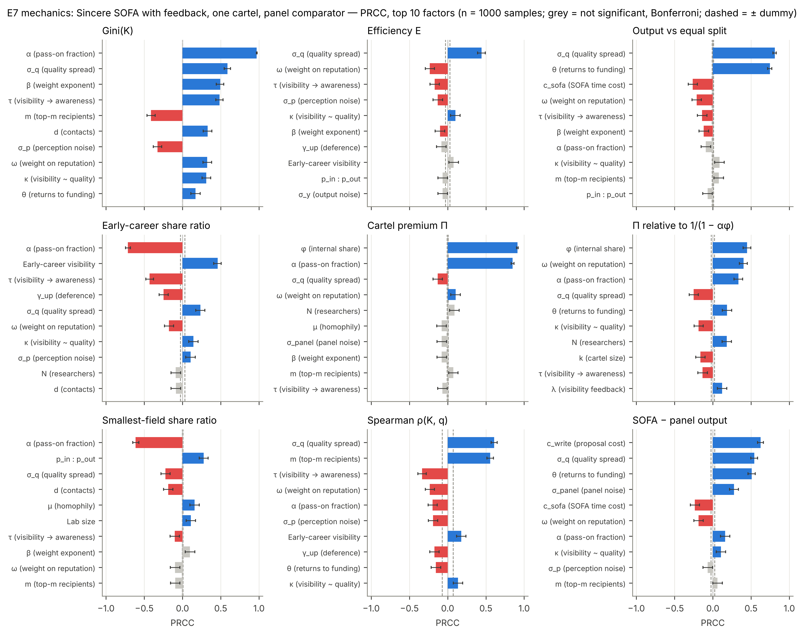
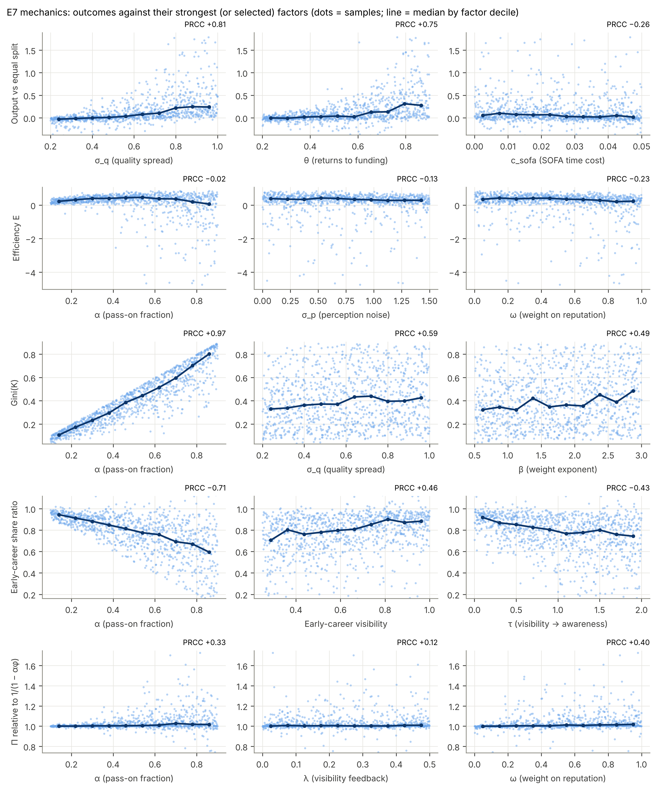
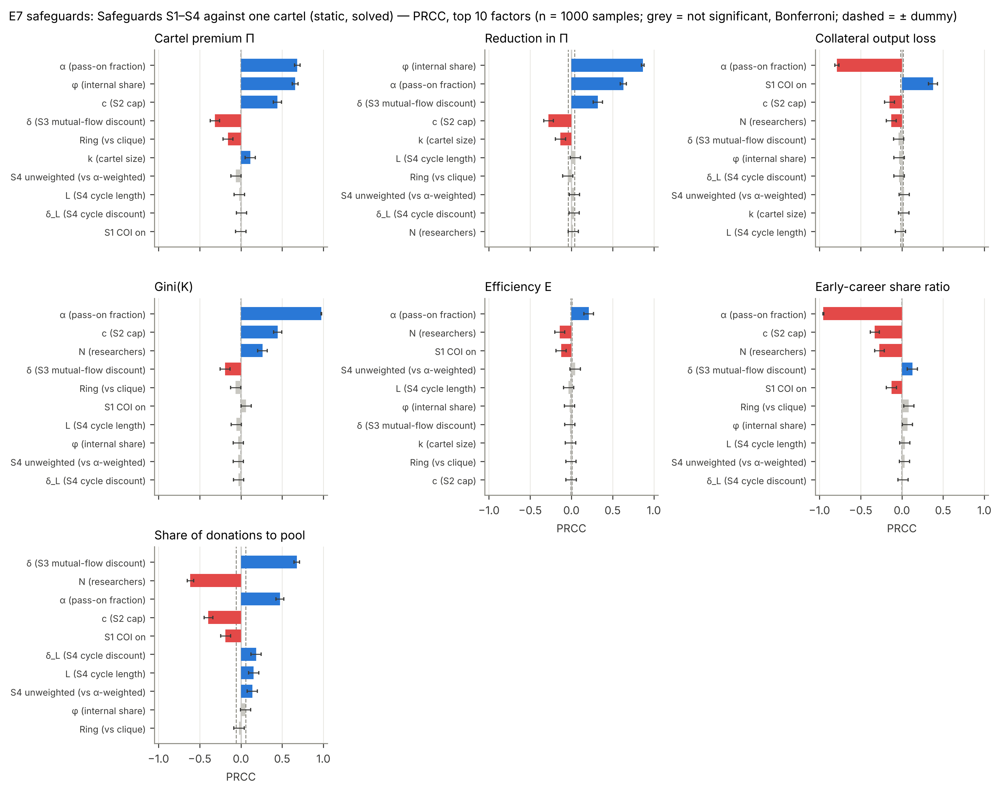
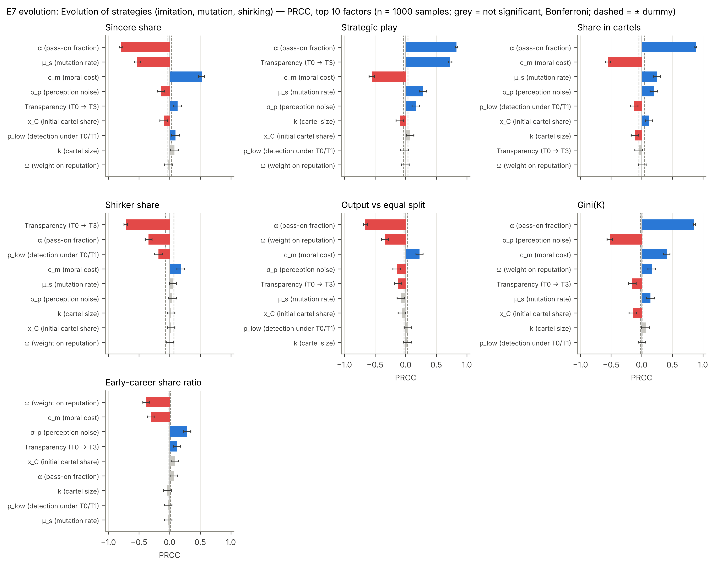

# Milestone 6 — global sensitivity analysis (E7), final figures, README, ODD complete

**Status:** complete, awaiting review. 326 tests pass; `ruff check` and `ruff format --check` are clean.
E7 ran at development scale (200 samples per block; 18 min) and at full scale (1000 samples per
block; 86 min on four cores). Every significant PRCC has the same sign at both scales, and the
leading factors are the same. Numbers below are full scale. No existing mechanism changed, so earlier
results are untouched. The one new switch, `s5_weighted`, matters only when audits are on
(p_audit > 0), and E6 already used the unweighted share.

The one-page summary of findings across M1–M6 is in [`summary.md`](summary.md).

**Headline.** Across the whole parameter space:
- α dominates concentration, equity and the spread of strategic behaviour.
- θ and the quality spread σ_q decide whether SOFA is worth having at all.
- **New finding: with reputation feedback, a cartel's premium is no longer bounded by
  1/(1 − αφ).** Its extra money becomes output, then visibility, then more donations. Under strong
  reputation weighting this compounds far beyond the static bound (§3.2).

---

## 1. M5 review decisions applied

| Decision | Action |
|---|---|
| 1. Keep μ_s = 0.01; report against null models | Recorded in CLAUDE.md §7 (E6). μ_s is also an E7 factor (0–0.05). |
| 2. Accept the shirking rule | Recorded in CLAUDE.md §4.9 and ODD §7.12. |
| 3. S5 threshold ("not sure") | **My recommendation, implemented behind a switch; please confirm or reverse.** See below. |
| 4. Add the early-career visibility multiplier, θ, μ_s, c_m to E7 | Done (ranges in §2). |

**Decision 3, explained.** The audit flags donors whose cycle-return share r exceeds r_thr. There are
two ways to measure r:
- **α-weighted** (the S4 definition): money that actually comes back. It shrinks with α and with
  every extra hop. A 5-clique has r ≈ 0.17 at α = 0.5, so r_thr = 0.2 misses it. Lowering r_thr would
  catch it at α = 0.5 but not at α = 0.3. With this measure a fixed threshold means something
  different at every α.
- **Unweighted**: the probability that a unit's routing returns to the donor within L hops. It does
  not depend on α. It is high for any closed routing structure (a ring scores 1 when L ≥ k, a
  5-clique 0.44 at L = 3), and low for sincere donors, whose routing rarely closes.

An audit is a *detection* rule (is this donor's routing circular?), not a discount on money that
returns, so the unweighted share fits its purpose. I therefore added a separate switch
`s5_weighted` (default **False** = unweighted) and kept S4's own default unchanged (α-weighted, as
specified). This changes no result: audits are off by default, and E6 already used the unweighted
share. Setting `s5_weighted = True` restores the old behaviour, and a test shows that it misses
5-cliques. CLAUDE.md §4.6 and §5 are amended accordingly.

## 2. What was built

| Module | Contents |
|---|---|
| `sensitivity.py` (new) | `Factor` (linear, log, integer, log-integer and categorical scales), Latin hypercube (`scipy.stats.qmc`), `apply_sample`, PRCC after Marino et al. (2008) with t-test p-values, Fisher-z intervals and Bonferroni flags. |
| `experiments.py` | E7 runner: three blocks, one hypercube each, one seed per sample, solve-or-simulate, annual cross-check for the solved block. |
| `plotting.py` | Per block: PRCC overview heatmap, tornado plots, and scatter plots with decile medians (monotonicity check). |
| `config.py`, `model.py` | `s5_weighted` switch. |
| `experiments/configs/E7.yaml` | Factors and ranges, documented in place. |
| `docs/ODD.md` | v5, complete: S6 is the only unimplemented (optional) element; adds an analysis section. |
| `README.md` | Completed for the final model. |

**Tests added** (12):
- Latin hypercube stratification, ranges, log-uniformity, categorical balance and reproducibility.
- Factor validation, and mapping samples onto `Params`.
- PRCC: recovers signs and the noise floor, invariant to monotone transforms, equals Spearman with
  one factor, drops missing outcomes, gives NaN for constant factors.
- Bonferroni table.
- The weighted S5 share missing 5-cliques.
- An end-to-end E7 run with plotting.

### 2.1 E7 design (judgement calls; please check)

1. **Three hypercubes instead of one.** If safeguards were factors in a single hypercube, every
   sample would run with a cap (c ≤ 0.5) and both discounts on, and every Gini and E would describe
   a safeguarded SOFA. Likewise for adaptation. So:
   - **mechanics** (26 factors): sincere SOFA with visibility feedback (λ is a factor, so every
     sample is simulated); one clique cartel for Π against the same seed without it; and a panel
     (A3, matched floor) for the SOFA-versus-panel outcome.
   - **safeguards** (12 factors): static W, solved. All-sincere and one cartel (clique or ring),
     each with the sampled safeguards off and on, giving Π, the reduction in Π and the collateral
     output loss.
   - **evolution** (10 factors): the E6 model (N = 500, T = 100, evaluation over the last 20 years).
2. **Ranges** are the "Explore" column of §5, with these choices:
   - **m:** "3–all" is sampled as 3–100 on a log scale (100 exceeds every awareness set at d ≤ 100).
   - **p_in : p_out:** 1–50 on a log scale.
   - **Added by me (spec range "—"):** μ_s 0–0.05, early-career visibility multiplier 0.25–1.0
     (default 0.5), and x_C 0.01–0.3.
   - **Ordinal codes:** the regime is coded T0 → T3 (0–3); topology, COI and S4 weighting are coded
     0/1.
   - **Not varied:** N in the evolution block (500), r_imit, κ_F, p_audit and the panel's c_rev and
     n_rev (no Explore range).
3. **One seed per sample.** Stochastic variation is part of the residual. A **dummy factor** that the
   model never reads gives the noise floor. It was not significant for any of the 23 outcomes.
4. **Monotonicity.** PRCC measures monotone association. The scatter figures show each outcome
   against its strongest factors (and E against α, where H1 predicts a peak).
5. **Sobol indices** (optional in §7) were **not** computed. With 26 factors they need
   n·(2D + 2) ≈ 54,000 runs per block for n = 1000, about 50 hours for the mechanics block on this
   machine. They would be affordable for the safeguards block (static, 12 factors) if you want them.
6. **Horizon.** T = 60 satisfies T − T_eval ≥ 5/(−ln α) up to α = 0.9. Safeguard cells are solved,
   so the pool rule does not apply; their annual cross-check gives 8.6e-14.

## 3. Results

Bars: PRCC with 95 % intervals. Colour: significant after Bonferroni (blue positive, red negative),
grey not significant. Dashed: ± the dummy's |PRCC|. Overview heatmaps: `figures/E7_overview_*.png`.

### 3.1 Sincere mechanics (RQ1, RQ5, RQ6), 1000 samples

| Outcome | Leading factors (PRCC) | Distribution over the hypercube (p10 / median / p90) |
|---|---|---|
| Gini(K) | **α +0.97**, σ_q +0.59, β +0.49, τ +0.48, m −0.41 | 0.13 / 0.38 / 0.74 |
| Output vs equal split | **σ_q +0.81, θ +0.75**, c_sofa −0.26, ω −0.21 | −5.4 % / +4.5 % / +51 %; positive in 70 % |
| SOFA − panel output | **c_write +0.63**, σ_q +0.54, θ +0.51, σ_panel +0.28 | +7.9 / +22 / +52 points; SOFA ahead in **98 %** |
| Early-career share ratio | **α −0.71**, early visibility +0.46, τ −0.43, γ_up −0.25 | 0.52 / 0.82 / 0.96; below 1 in **97 %** |
| Smallest-field share ratio | **α −0.61**, p_in:p_out +0.28, σ_q −0.22 | 0.51 / 0.92 / 1.00; below 1 in 91 % |
| Efficiency E | σ_q +0.44, ω −0.23 (weak; see below) | negative in 17 % |
| Cartel premium Π | **φ +0.91, α +0.85** | — |

- **H1 holds across the space.** Gini rises with α everywhere (PRCC +0.97). E peaks at intermediate
  α: the median is 0.29 at α ≤ 0.3, 0.42 at 0.3–0.7, and 0.21 at α > 0.7. Because this is
  non-monotone, PRCC rates α as unimportant for E. This is a limitation of the method, not a sign
  that α has no effect (scatter figure).
- **H1's claim that E falls with σ_p** remains only weakly supported (PRCC −0.13), as in M2.
- **RQ6: SOFA beats panel review in 98 % of the hypercube.** It loses only when proposal writing is
  cheap and quality is homogeneous. Whether SOFA beats *equal split* is less certain: in 30 % of the
  space it does worse. θ and σ_q decide this:
  - θ ≤ 0.4: median gain +0.1 %;
  - θ > 0.6: median gain +18 %.

  The model cannot settle these two quantities; they are empirical.
- **H5: the early-career deficit is robust.** Early-career researchers are below their population
  share in 97 % of samples. The deficit grows with α and with τ (awareness following visibility).
  The stage penalty in initial visibility (the M4 addendum) matters, but does not remove it: the
  median ratio is 0.77 at multipliers 0.25–0.5 and 0.88 at 0.75–1.0. Deference (γ_up) adds to the
  deficit.
- **The small-field drain is robust** (91 % of samples). It grows with α and shrinks with the
  within-field preference p_in : p_out, as the group-balance mechanism of M2 predicts.

### 3.2 New: reputation feedback lets cartels exceed the analytic bound

The ratio Π/(1/(1 − αφ)) has median 1.004, but it exceeds 1.05 in **19 %** of samples, and 1.5 in
1.3 %. The maximum is **11.9**: a 2-member cartel at α = 0.79, φ = 0.95 and ω = 0.94 ends with 48×
its counterfactual funding.

**Mechanism (checked by switching parts off in two extreme samples):**
1. The cartel's extra funding raises its members' output.
2. Under λ > 0, that output raises their visibility.
3. With ω > 0, visibility raises sincere outsiders' perception of them, so the inflow from outside,
   I_C, rises.

That breaks the bound's one assumption (§2.3.5: I_C must not rise). With λ = 0 or ω = 0, the same
samples fall back below the bound (0.80–0.97). Across the hypercube the exceedance rises with ω:

| ω | 0–0.25 | 0.25–0.5 | 0.5–0.75 | 0.75–1 |
|---|---|---|---|---|
| samples with Π > 1.05 × bound | 4 % | 16 % | 27 % | 28 % |

With ω < 0.05 the maximum is 1.016, comparable to the static exceedance found at M3 (≤ 0.8 %).

This links RQ2 and RQ5. Under reputation feedback, collusion launders money into reputation, and
reputation attracts sincere money. E2–E4 never combined cartels with feedback, so this is the first
time it has shown up. **The §2.3.5 bound holds only without the feedback loop** (proposed amendment,
§5).

### 3.3 Safeguards (RQ4), 1000 samples, solved

- **Π** rises with α (+0.68), φ (+0.66) and a looser cap (c +0.44), and falls with S3's δ (−0.32).
  Share of the excess premium removed (median): cliques 0.48, rings 0.66.
- **The cap works against rings and is evaded by large cliques**, as in E4:
  - rings: median removal 0.86 when c ≤ 0.2, against 0.49 otherwise;
  - cliques: 0.45 once (k − 1)c ≥ 1, against 0.69 otherwise.
- **S4 has no significant PRCC on Π.** This does not mean it is ineffective: it acts only through an
  interaction (rings with L ≥ k). For unweighted S4 against rings with L ≥ k and δ_L > 0.5, the
  median removal is 0.79. PRCC, which averages over the whole space, cannot see such interaction
  effects. E4 remains the right evidence for S4.
- **Collateral cost is small everywhere** (median 0.0, p90 0.3 percentage points of output). At high α
  it is *negative*, meaning safeguards *raise* sincere output (96 % of samples at α > 0.7). Caps and
  discounts curb over-concentration, the same effect that makes E fall at high α. COI is the one
  safeguard with a consistent cost (+0.38): it removes labmates from sincere choice sets.

### 3.4 Evolution (RQ3, RQ4), 1000 samples

| Outcome | Leading factors (PRCC) |
|---|---|
| Sincere share | **α −0.80**, μ_s −0.53, c_m +0.52 |
| Strategic play (actually played) | **α +0.83, regime +0.73**, c_m −0.55, μ_s +0.29 |
| Share in cartels | **α +0.88**, c_m −0.55, μ_s +0.25 |
| Shirker share | **regime −0.71**, α −0.34, p_low −0.18 |
| Output vs equal split | **α −0.66**, ω −0.34, c_m +0.23 |

- **α is the strongest driver of strategic behaviour.** E6 fixed α at 0.5. Across the hypercube,
  median strategic play is 20 % at α ≤ 0.3 and 79 % at α > 0.7, and cartel membership rises from
  6 % to 59 %. The premium 1/(1 − αφ) is what makes collusion pay, so the same α that strengthens
  SOFA's signal also makes manipulation spread. The trade-off at the heart of the mechanism (§2.3.5)
  therefore holds for behaviour too, not just for a fixed cartel.
- **Transparency unlocks strategies and removes shirking.** The E6 result holds over the whole
  space. Median strategic play is 12 % / 29 % / 49 % / 64 % from T0 to T3. Shirking is confined to
  T0/T1.
- **c_m and μ_s matter as much as anything except α.** The agreed decision to report against null
  models stands. Prevalence levels depend on two parameters for which there is no evidence.

## 4. Things worth knowing

- **Development and full scale agree.** All 87 PRCCs significant at dev scale have the same sign at
  full scale. The largest change among leading coefficients (|PRCC| > 0.3) is 0.23: the
  early-career visibility multiplier on the early-career ratio, 0.23 at dev and 0.46 at full scale.
  Dev scale's 200 samples gave wide intervals.
- **Runtime.** The mechanics block averages 15 s per sample (N up to 2000; three simulations each).
- **Output above +100 %** occurs in a few samples (θ ≈ 0.9, σ_q ≈ 1). There the oracle itself gains
  up to +1100 %: with weak diminishing returns and very unequal quality, concentrating funding
  pays enormously. The scatter axes are clipped to the 1st–99th percentiles.

## 5. Decisions needed

1. **S5 weighting** (§1). Keep the unweighted share as the S5 default (my recommendation,
   implemented), or revert to the α-weighted one?
2. **Amend §2.3.5.** Proposed wording: "The bound assumes that I_C does not rise. With reputation
   feedback (λ > 0, ω > 0) it can rise without limit, because funding raises visibility; E7 finds Π
   above the bound in 19 % of the hypercube, up to 12×." Should E2 also get a feedback variant, so
   that this is measured on a grid (for example λ = 0.2 × ω ∈ {0, 0.3, 0.6})?
3. **Sobol indices.** Skip (my recommendation; the PRCC picture is clear and the cost is high), or
   compute them for the safeguards block only (about 7 hours)?
4. **E7 design.** Accept the three-block design (§2.1, call 1), or prefer a single hypercube as §7
   literally reads?

## 6. Not done

Sobol indices (optional, §5 decision 3). S6 receipt ceiling (optional, never specified as required).
Out-of-scope items in CLAUDE.md §13 remain open.
